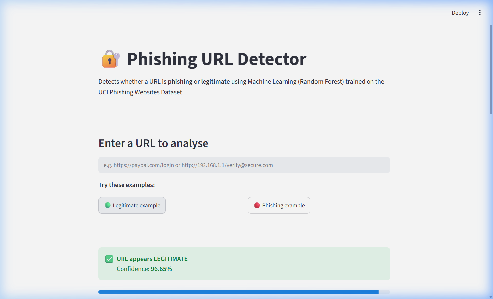
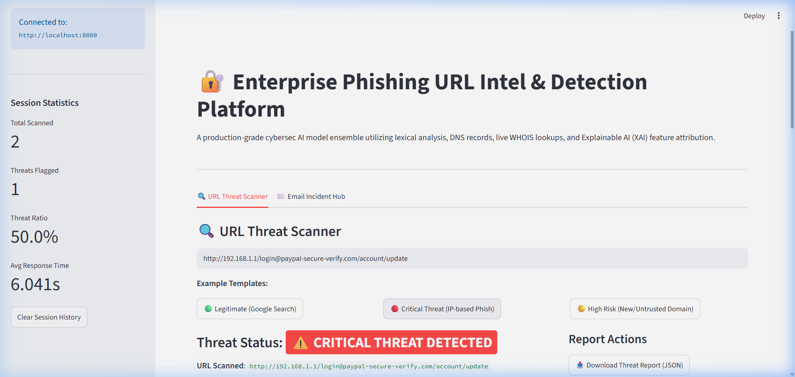
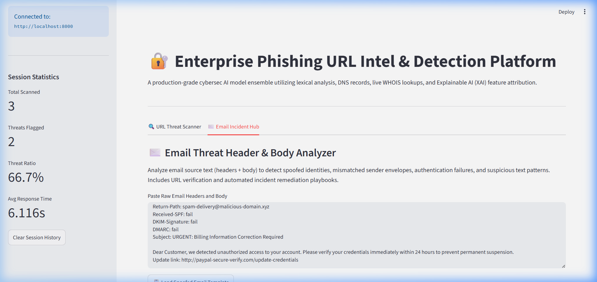

# Phishing URL Detector & Email Security Portal

A cybersecurity tool that detects phishing URLs and analyzes spoofed email messages in real time. It uses a hybrid machine learning ensemble (Random Forest + Logistic Regression) alongside DNS/WHOIS queries, brand impersonation detection, and automated incident response playbooks.

## Key Features

*   **Ensemble ML Model**: Combines a Random Forest classifier (structural/lexical features) and a TF-IDF Logistic Regression model (textual analysis) for robust URL checks.
*   **Feature Contribution Breakdown**: Visualizes local feature weight contributions to show exactly why a URL was flagged.
*   **OSINT Lookups**: Performs real-time DNS (A/MX record) and WHOIS domain lifecycle lookups with safe fallbacks.
*   **Impersonation & Homoglyph Protection**: Checks for brand typosquatting using Levenshtein distance and flags Unicode script homoglyph lookalikes.
*   **SOC Email Analyzer**: Parses SPF, DKIM, and DMARC headers, highlights Return-Path envelope mismatches, scans body URLs, and recommends incident playbooks.
*   **Playwright Test Suite**: Fully automated E2E tests built on the Page Object Model (POM) pattern.
*   **Docker Deployment**: Containerized configuration for backend and frontend services.

---

## Getting Started

### 1. Installation

```bash
git clone https://github.com/Sindhura18/phishing-url-detector.git
cd phishing-url-detector
python -m venv .venv
.\.venv\Scripts\activate
pip install -r requirements.txt
python -m playwright install --with-deps chromium
```

### 2. Train the Models

```bash
python train.py
```

### 3. Running Locally

Start the FastAPI backend:
```bash
uvicorn src.api:app --port 8000
```

Start the Streamlit interface:
```bash
streamlit run app.py --server.port 8501
```

### 4. Running with Docker

```bash
docker-compose up --build
```

---

## Running Tests

```bash
pytest -v
```

---

## App Screenshots

### URL Scanner (Legitimate Result)


### URL Scanner (Phishing Result)


### Email Hub & Playbook

